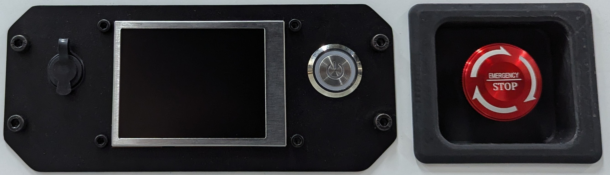
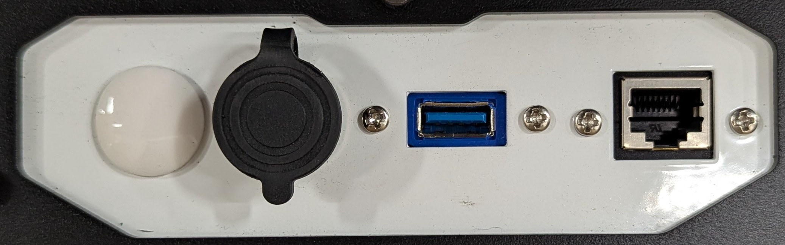
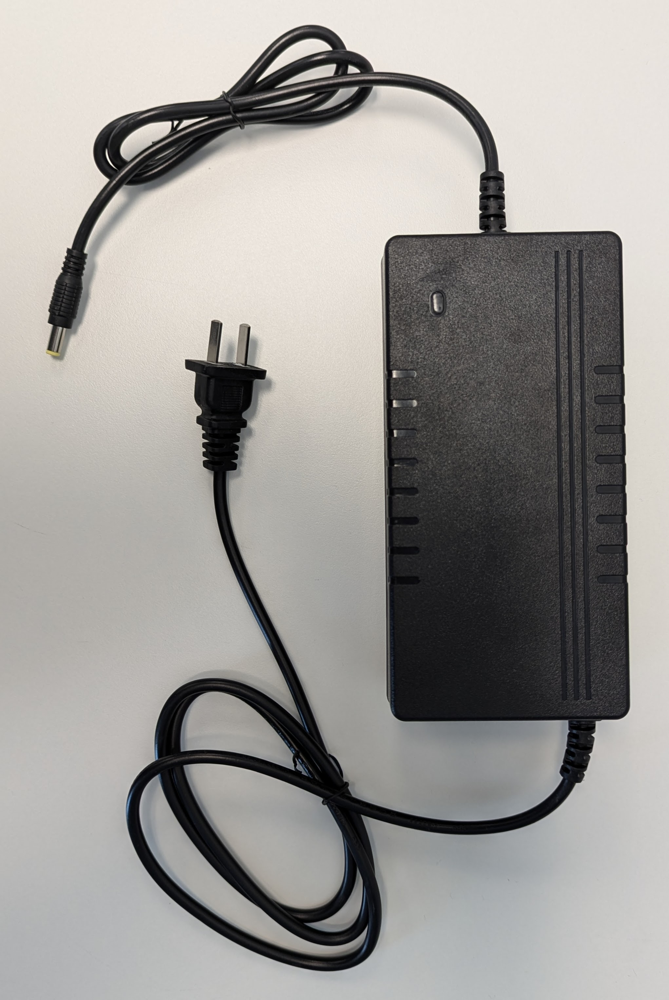

===========
Basic Usage
===========

Rear Interface Panel
====================

Interfaces from the left:

* Charger Port
* Screen
* Power Button
* Emergency Stop Button

Top Interface Panel
===================

Interface from the left:

* Unused
* Power breakout — VBat (~24V), 12V
* Serial
* RJ45 (Unused)

Plug-In Charger
===============

The SLATE base comes with a plug-in battery charger with the following specifications:

* ~110VAC 60Hz On
* 24VDC - 29.4VDC Out
* 5A
* 160W

To charge the SLATE base's battery with the plug-in charger, plug the charger's barrel jack into the base's Charger Port.
See the :ref:`getting_started/basic_usage:Rear Interface Panel` for details on the port.

While charging, the plug-in charger's LED will be red.
When fully charged or disconnected, the plug-in charger's LED will be green.

Contact Charger
===============

The SLATE base comes with a contact charger.

To charge the SLATE base's battery with the contact charger, follow the procedure below:

#.  Plug the plug-in charger into the contact charger's barrel jack port.
#.  Press the power button on the contact charger to turn it on.
    The power button will turn green when on.
#.  Drive the SLATE base into the contact charger, ensuring that both pads on the base and the retractable contacts on the contact charger are touching.
#.  Use the ``enable_charging`` service of the SLATE's ROS driver to activate the base's internal charging relay.
#.  Check the following two indications to ensure the base is charging:

    * The light on the top of the contact charger turns green
    * The base's screen reports a "Charging" status

#.  The light on the top of the contact charger will turn off when the base is fully charged.
